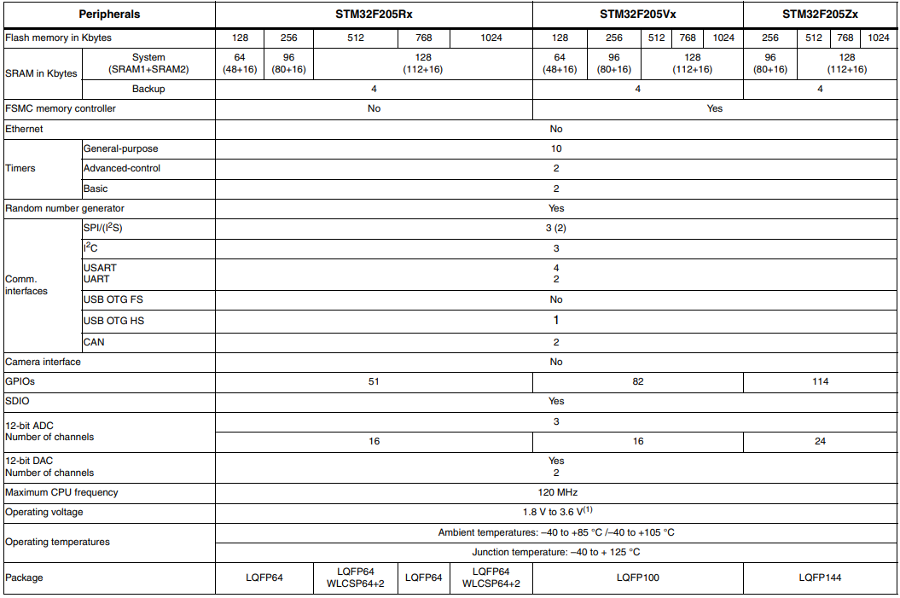

# [STM32F205](https://github.com/SoCXin/STM32F205)

* [ST](https://www.st.com/zh/)：[Cortex-M3](https://github.com/SoCXin/Cortex)
* [L4R5](https://github.com/SoCXin/Level) ：120 MHz x 1.25 DMIPS/MHz (398CoreMark)

## [简介](https://github.com/SoCXin/STM32F205/wiki)

[STM32F205](https://github.com/SoCXin/STM32F205) 系列采用意法90nm NVM制程制造而成，具有创新型自适应实时存储加速器（ART Accelerator™）和多层总线矩阵，实现了前所未有的高性价比。

意法半导体的加速技术使这些微控制器能够在120 MHz FCPU主频实现高达150 DMIPS/398 CoreMark的性能，等效于零等待状态执行，同时还能保持极低的动态电流消耗水平（175 µA/MHz）。

IO数量较多，器件提供的封装选项包括LQFP64、LQFP100、LQFP144、WLCSP66（< 4 × 4mm）、UFBGA176和LQFP176。

#### 关键特性

* 1MB Flash
* USB 2.0 HS OTG

### [资源收录](https://github.com/SoCXin)

* [参考资源](src/)
* [参考文档](docs/)
* [参考工程](project/)

### [选型建议](https://github.com/SoCXin)

[STM32F205](https://github.com/SoCXin/STM32F205) 相比较[STM32F1](https://github.com/SoCXin/STM32F1)系列具有更全面的提升

* STM32F20505/215 – 120 MHz CPU/150 DMIPS，具有先进连接功能和加密功能的高达1 MB Flash存储器
* STM32F20507/217 – 120 MHz CPU/150 DMIPS，在STM32F20505/215基础上增加了以太网MAC和照相机接口；大尺寸封装可提供更多GPIO和功能

###  [探索芯世界 www.SoC.xin](http://www.SoC.Xin)
