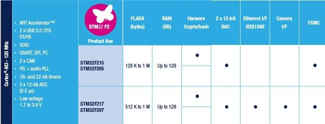

# [STM32F2](https://github.com/sochub/STM32F2)

 

#### [Vendor](https://github.com/sochub/Vendor)：[ST](https://github.com/sochub/ST)
#### [Cortex](https://github.com/sochub/Cortex)：[Cortex M3](https://github.com/sochub/CM3) 
#### [Level](https://github.com/sochub/Level)：120MHz （150 DMIPS/398 CoreMark）

## [描述](https://github.com/sochub/STM32F2/wiki) 

[STM32F2](https://github.com/sochub/STM32F2)系列基于Arm® Cortex®-M3的STM32 F2系列采用意法半导体先进的90 nm NVM制程制造而成，具有创新型自适应实时存储加速器（ART Accelerator™）和多层总线矩阵，实现了前所未有的高性价比。

该系列具有集成度高的特点：整合了1MB Flash存储器和最高到128KB的 SRAM、以太网MAC、USB 2.0 HS OTG、照相机接口、硬件加密支持和外部存储器接口。

意法半导体的加速技术使这些微控制器能够在120 MHz FCPU主频实现高达150 DMIPS/398 CoreMark的性能，等效于零等待状态执行，同时还能保持极低的动态电流消耗水平（175 µA/MHz）。

[STM32F2](https://github.com/sochub/STM32F2)系列的IO数量较高，器件提供的封装选项包括LQFP64、LQFP100、LQFP144、WLCSP66（< 4 × 4mm）、UFBGA176和LQFP176。

STM32F205/215 – 120 MHz CPU/150 DMIPS，具有先进连接功能和加密功能的高达1 MB Flash存储器
STM32F207/217 – 120 MHz CPU/150 DMIPS，在STM32F205/215基础上增加了以太网MAC和照相机接口；大尺寸封装可提供更多GPIO和功能

 

### [收录资源](https://github.com/sochub/STM32F2)

* [参考文档](docs/)
* [参考资源](src/)

* [编译工具](https://github.com/sochub/arm-none-eabi)

### [收录型号](https://github.com/sochub/STM32F2)

* [STM32F205/215](https://github.com/sochub/STM32F205) 
* [STM32F207/217](https://github.com/sochub/STM32F207) 

### [选型建议](https://github.com/sochub)

[STM32F2](https://github.com/sochub/STM32F2)系列相比较[STM32F1](https://github.com/sochub/STM32F1)系列具有更全面的提升

##  [SoC资源平台](http://www.qitas.cn)  
