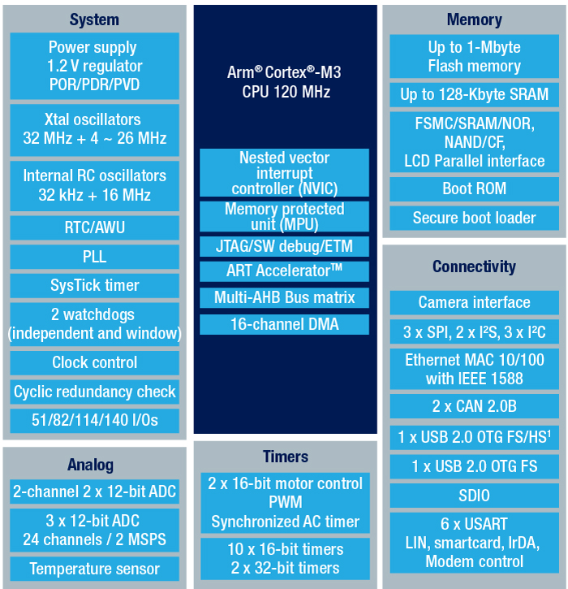

# [STM32F207](https://github.com/SoCXin/STM32F207)

* [ST](https://www.st.com/zh/): [Cortex-M3](https://github.com/SoCXin/Cortex)
* [L4R5](https://github.com/SoCXin/Level): 120 MHz (150DMIPS/398CoreMark)

## [简介](https://github.com/SoCXin/STM32F207/wiki)

[STM32F207](https://github.com/SoCXin/STM32F207) 系列采用意法90nm NVM制程制造而成，具有创新型自适应实时存储加速器（ART Accelerator™）和多层总线矩阵，实现了前所未有的高性价比。

### 关键特性

* 15个通信接口（6个7.5 Mb/s的USART、3个30 Mb/s的SPI、3个I²C、2个CAN、SDIO）
* 2x12bit DAC、24ch 3x12bit ADC 2MSPS（交错模式6MSPS）
* 2个USB OTG（其中一个支持HS）
* 175 µA/MHz的功耗（@ 120 MHz）
* STM32F217还整合了加密/HASH处理器，为AES 128、192、256、Triple DES和HASH（MD5、SHA-1）提供硬件加速。

### [资源收录](https://github.com/SoCXin)

* [参考资源](src/)
* [参考文档](docs/)
* [参考工程](project/)

### [选型建议](https://github.com/SoCXin)

[STM32F207](https://www.st.com/zh/microcontrollers-microprocessors/stm32f2x7.html)是STM32高性能MCU的入门级产品，已经比较悠久，相较低配版本[STM32F205](https://www.st.com/zh/microcontrollers-microprocessors/stm32f2x5.html) 增加了符合IEEE 1588 v2标准要求的以太网MAC10/100和能够连接CMOS照相机传感器的8-14位并行摄像头接口，并且只有100-176引脚封装。

#### 封装规格

* STM32F205: LQFP144 (20×20mm)
* STM32F205: LQFP100 (14×14mm)
* STM32F205: LQFP64 (10×10mm)
* STM32F205: WLCSP66 (4×4mm)
* STM32F207: LQFP100 (14×14mm)
* STM32F207: LQFP144 (20×20mm)
* STM32F207: BGA/LQFP176

[STM32F2系列](https://www.st.com/zh/microcontrollers-microprocessors/stm32f2-series.html)与[STM32F1系列](https://www.st.com/zh/microcontrollers-microprocessors/stm32f1-series.html)外设兼容性

### 相关开发板 (NUCLEO-F207ZG)

### [探索芯世界 www.SoC.xin](http://www.SoC.Xin)
